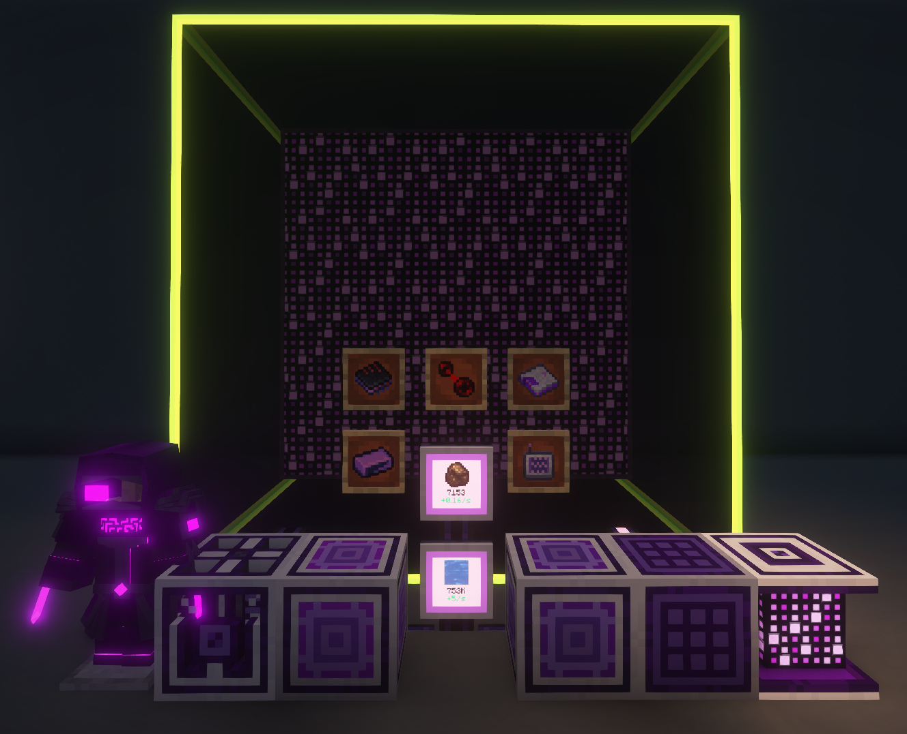

---
navigation:
  title: Advanced AE 简介
  position: 70
---

# Advanced AE！

Advanced AE 专注于改善 ME 系统的使用体验，并拓展终局系统的可能性。这个模组允许你升级样板供应器，使其能够将物品推送到目标机器的指定面；还可以创建能够在拥有合成存储空间时无限运行合成任务、共享协处理器的多方块计算机，此外还有大量其他便利性功能！

如需查看模组提供的全部方块和物品，请参阅以下指南页面：

## 高级设备

<CategoryIndex category="advanced devices"></CategoryIndex>

## 高级物品

<CategoryIndex category="advanced items"></CategoryIndex>

发现问题或缺少某项功能？
请在这里反馈：
[Advanced AE GitHub](https://github.com/pedroksl/AdvancedAE)