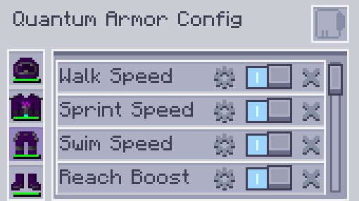

---
navigation:
  parent: aae_intro/aae_intro-index.md
  title: 量子装甲套装
  icon: advanced_ae:quantum_helmet
categories:
  - advanced items
item_ids:
  - advanced_ae:quantum_helmet
  - advanced_ae:quantum_chestplate
  - advanced_ae:quantum_leggings
  - advanced_ae:quantum_boots
  - advanced_ae:quantum_upgrade_base
  - advanced_ae:walk_speed_card
  - advanced_ae:sprint_speed_card
  - advanced_ae:step_assist_card
  - advanced_ae:jump_height_card
  - advanced_ae:lava_immunity_card
  - advanced_ae:flight_card
  - advanced_ae:water_breathing_card
  - advanced_ae:auto_feeding_card
  - advanced_ae:auto_stock_card
  - advanced_ae:magnet_card
  - advanced_ae:hp_buffer_card
  - advanced_ae:evasion_card
  - advanced_ae:regeneration_card
  - advanced_ae:strength_card
  - advanced_ae:attack_speed_card
  - advanced_ae:luck_card
  - advanced_ae:reach_card
  - advanced_ae:swim_speed_card
  - advanced_ae:night_vision_card
  - advanced_ae:flight_drift_card
  - advanced_ae:recharging_card
  - advanced_ae:portable_workbench_card
  - advanced_ae:pick_craft_card
---

# 量子装甲套装

<Row gap="10">
<ItemImage id="advanced_ae:quantum_helmet" components="ae2:stored_energy=2.0E8d" scale="4"></ItemImage>
<ItemImage id="advanced_ae:quantum_chestplate" components="ae2:stored_energy=3.0E8d" scale="4"></ItemImage>
<ItemImage id="advanced_ae:quantum_leggings" components="ae2:stored_energy=2.5E8d" scale="4"></ItemImage>
<ItemImage id="advanced_ae:quantum_boots" components="ae2:stored_energy=2.0E8d" scale="4"></ItemImage>
</Row>

<ItemGrid>
<ItemIcon id="advanced_ae:quantum_helmet" components="ae2:stored_energy=2.0E8d"></ItemIcon>
<ItemIcon id="advanced_ae:quantum_chestplate" components="ae2:stored_energy=3.0E8d"></ItemIcon>
<ItemIcon id="advanced_ae:quantum_leggings" components="ae2:stored_energy=2.5E8d"></ItemIcon>
<ItemIcon id="advanced_ae:quantum_boots" components="ae2:stored_energy=2.0E8d"></ItemIcon>
</ItemGrid>

你是否曾想过穿戴自己的 AE 系统会是什么感觉？现在无需再想象了。量子装甲套装是一套高科技隐形装备，可以连接到 AE2 系统，随时随地便捷地访问其中的一切！默认情况下，它是一套防御力堪比下界合金装备的能源驱动套装。它可以利用自身缓冲能量制造能量护盾，吸收大量伤害。靴子还可以免疫摔落伤害，而胸甲可以消除飞行采矿惩罚。不过，只有装满升级卡后，这套装备真正的力量才会解锁！

 

## 连接装甲

可以将各件装甲分别放入<ItemLink id="ae2:wireless_access_point" />的对应槽位，以将其单独连接到系统。根据装备部件和已安装的升级卡，这会解锁不同的增益效果，详情见后文。请注意，要使这些额外功能正常工作，你还必须处于已连接访问点的范围内。

 

## 安装升级卡

要安装升级卡，需要先装备装甲，然后按下快捷键打开量子装甲配置菜单（默认为 N）。

在此界面中，你可以添加或移除升级卡、启用或禁用升级卡，以及配置具有可调设置的升级卡。

 

## 量子升级基卡

<ItemImage id="advanced_ae:quantum_upgrade_base" scale="2"></ItemImage>

<ItemLink id="advanced_ae:quantum_upgrade_base" />本身没有特殊功能，但它是所有升级卡的合成材料。

 

## 自动喂食卡

<ItemImage id="advanced_ae:auto_feeding_card" scale="2"></ItemImage>

<ItemLink id="advanced_ae:auto_feeding_card" />允许选择用于喂食玩家的特定物品。只需将所需物品拖入过滤槽；如果装备已连接到 AE2 网络，玩家饥饿时它就会尝试从系统中找到这些物品并进行喂食。

 

## 自动补货卡

<ItemImage id="advanced_ae:auto_stock_card" scale="2"></ItemImage>

<ItemLink id="advanced_ae:auto_stock_card" />同样要求装备部件连接到 AE2 系统，并处于访问点的有效范围内。它允许配置若干物品组，使玩家物品栏中始终保有指定数量。槽位不受单组物品数量限制，因此可以根据需要设置多个槽位始终装有这些物品。

 

## 速度卡

<Row gap="10">
<ItemImage id="advanced_ae:walk_speed_card" scale="2"></ItemImage>
<ItemImage id="advanced_ae:sprint_speed_card" scale="2"></ItemImage>
<ItemImage id="advanced_ae:swim_speed_card" scale="2"></ItemImage>
</Row>

* <ItemLink id="advanced_ae:walk_speed_card" />
* <ItemLink id="advanced_ae:sprint_speed_card" />
* <ItemLink id="advanced_ae:swim_speed_card" />

这些升级卡可以提高套装穿戴者的移动速度。它们都可以配置移动速度，也会影响潜行和飞行时的移动。需要注意的是，当存在其他加速效果时，这些升级卡也可以用于降低速度，以便进行更精确的控制。

 

## 高度卡

<Row gap="10">
<ItemImage id="advanced_ae:jump_height_card" scale="2"></ItemImage>
<ItemImage id="advanced_ae:step_assist_card" scale="2"></ItemImage>
</Row>

* <ItemLink id="advanced_ae:jump_height_card" />
* <ItemLink id="advanced_ae:step_assist_card" />

这些升级卡会改变垂直移动，允许配置更高的跳跃高度或启用自动上台阶。

 

## 飞行卡

<Row gap="10">
<ItemImage id="advanced_ae:flight_card" scale="2"></ItemImage>
<ItemImage id="advanced_ae:flight_drift_card" scale="2"></ItemImage>
</Row>

### 飞行卡

安装<ItemLink id="advanced_ae:flight_card" />后可以启用创造模式飞行。可以使用界面中的滑块配置飞行速度。步行/疾跑速度升级还会以加法方式影响该速度。

### 飞行惯性卡

<ItemLink id="advanced_ae:flight_drift_card" />仅在安装飞行卡时生效，并会增加一个配置滑块，用于改变创造模式飞行时的惯性。数值越低，停止得越快；设为0时会立即停止。

 

## ME 充能卡

<ItemImage id="advanced_ae:recharging_card" scale="2"></ItemImage>

<ItemLink id="advanced_ae:recharging_card" />可以为已装备的装甲部件进行无线充能。这要求装甲连接到网络，并处于访问点范围内。将此升级安装在胸甲上，还可以为物品栏中的物品充能。

 

## 便携工作台卡

<ItemImage id="advanced_ae:portable_workbench_card" scale="2"></ItemImage>

<ItemLink id="advanced_ae:portable_workbench_card" />会为量子装甲套装添加便携式元件工作台。按下配置的快捷键即可打开，其功能与方块形式相同。

 

## 选取合成卡

<ItemImage id="advanced_ae:pick_craft_card" scale="2"></ItemImage>

<ItemLink id="advanced_ae:pick_craft_card" />会为装甲添加一个新的快捷键功能。按下快捷键后，会尝试合成玩家当前瞄准的方块。此功能要求装甲连接到网络，并且网络中有与目标匹配的样板。随后会弹出窗口要求输入所需数量，流程与普通自动合成请求完全相同。

 

## 实用卡

<Row gap="10">
<ItemImage id="advanced_ae:night_vision_card" scale="2"></ItemImage>
<ItemImage id="advanced_ae:lava_immunity_card" scale="2"></ItemImage>
<ItemImage id="advanced_ae:water_breathing_card" scale="2"></ItemImage>
<ItemImage id="advanced_ae:magnet_card" scale="2"></ItemImage>
<ItemImage id="advanced_ae:camo_card" scale="2"></ItemImage>
</Row>

* <ItemLink id="advanced_ae:night_vision_card" />
* <ItemLink id="advanced_ae:lava_immunity_card" />
* <ItemLink id="advanced_ae:water_breathing_card" />
* <ItemLink id="advanced_ae:magnet_card" />
* <ItemLink id="advanced_ae:camo_card" />

这些卡会为套装穿戴者提供多种实用功能，包括免疫某些类型的伤害以及提供夜视。磁力卡尤其具有配置界面，可以设置要拾取或忽略的物品过滤器，并配置其作用范围。

 

## 防御卡

<Row gap="10">
<ItemImage id="advanced_ae:hp_buffer_card" scale="2"></ItemImage>
<ItemImage id="advanced_ae:regeneration_card" scale="2"></ItemImage>
<ItemImage id="advanced_ae:evasion_card" scale="2"></ItemImage>
</Row>

* <ItemLink id="advanced_ae:hp_buffer_card" />
* <ItemLink id="advanced_ae:regeneration_card" />
* <ItemLink id="advanced_ae:evasion_card" />

这些升级卡会以不同形式为套装穿戴者提供防御增益。生命值卡会提高最大生命值，生命恢复卡会提高生命恢复速度，而闪避卡有概率完全免疫任何伤害来源。

 

## 攻击卡

<Row gap="10">
<ItemImage id="advanced_ae:strength_card" scale="2"></ItemImage>
<ItemImage id="advanced_ae:attack_speed_card" scale="2"></ItemImage>
</Row>

* <ItemLink id="advanced_ae:strength_card" />
* <ItemLink id="advanced_ae:attack_speed_card" />

这些升级卡会增强穿戴者的攻击能力，提高攻击伤害和攻击速度。

 

## 属性卡

<Row gap="10">
<ItemImage id="advanced_ae:luck_card" scale="2"></ItemImage>
<ItemImage id="advanced_ae:reach_card" scale="2"></ItemImage>
</Row>

* <ItemLink id="advanced_ae:luck_card" />
* <ItemLink id="advanced_ae:reach_card" />

这些升级卡会直接提高穿戴者的属性，包括提高幸运以获得更好的战利品掉落结果，以及增加方块交互距离。触及距离卡可以配置为指定数值。

 

## 敬请期待

这套装备作为基础版本发布，未来还计划加入大量其他功能，敬请期待！