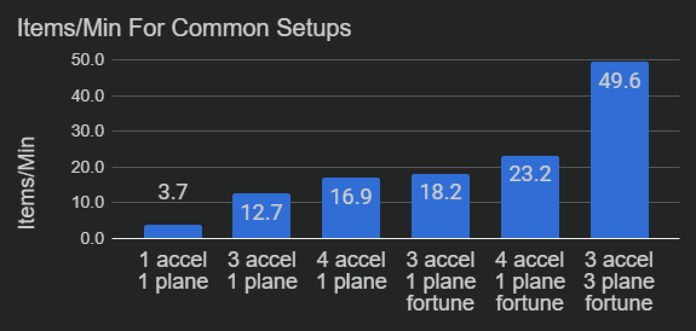

---
navigation:
  parent: ae2-mechanics/ae2-mechanics-index.md
  title: 赛特斯石英培育
  icon: quartz_cluster
---

# 赛特斯石英培育

## 基本上就是从入门页面复制粘贴过来的

<GameScene zoom="6" background="transparent">
<ImportStructure src="../assets/assemblies/budding_certus_1.snbt" />
</GameScene>

赛特斯石英芽会从[赛特斯石英母岩](../items-blocks-machines/budding_certus.md)上生长出来，类似于紫水晶。如果你破坏一个尚未长成的石英芽，它会掉落一个<ItemLink id="certus_quartz_dust" />，时运附魔不影响掉落。如果你破坏一个完全长成的石英簇，它会掉落四个<ItemLink id="certus_quartz_crystal" />，时运附魔会增加这个数量。

赛特斯石英母岩有4个等级：无瑕的、有瑕的、开裂的和损坏的，你最初可以在[陨石](../ae2-mechanics/meteorites.md)中找到它们。

<GameScene zoom="4" background="transparent">
  <ImportStructure src="../assets/assemblies/budding_blocks.snbt" />
  <IsometricCamera yaw="195" pitch="30" />
</GameScene>

每次石英芽生长一个阶段，母岩都有一定几率降级一个等级，最终变成普通的赛特斯石英块。将母岩（或赛特斯石英块）与一个或多个<ItemLink id="charged_certus_quartz_crystal" />一起丢入水中可以修复它们（或创建新的母岩）。

<RecipeFor id="damaged_budding_quartz" />

无瑕的赛特斯石英母岩不会降级，并且可以无限生成赛特斯石英。然而，它们无法被制作，也无法用镐采集，即使是精准采集也不行。（不过它们*可以*通过[空间存储](../ae2-mechanics/spatial-io.md)移动）

石英芽本身生长非常缓慢。幸运的是，<ItemLink id="growth_accelerator" />放置在母岩旁边时会大幅加速这个过程。你应该优先建造几个催生器。

<GameScene zoom="4" background="transparent">
  <ImportStructure src="../assets/assemblies/budding_certus_2.snbt" />
  <IsometricCamera yaw="195" pitch="30" />
</GameScene>

复杂的交互意味着母岩的每个被覆盖的面都会降低母岩的累积生长速度，最终超过增加更多催生器带来的效果。实验测试结果如下：

如果你没有足够的石英来制作<ItemLink id="energy_acceptor" />或<ItemLink id="vibration_chamber" />，你可以制作一个<ItemLink id="crank" />并将其安装在催生器的末端。

自动收获赛特斯石英的方法[在这里有描述](../example-setups/simple-certus-farm.md)。