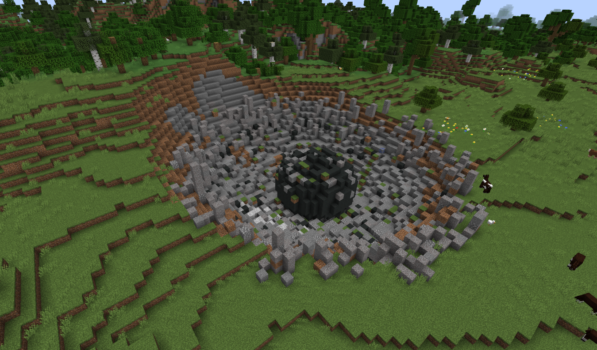

---
navigation:
  parent: ae2-mechanics/ae2-mechanics-index.md
  title: 陨石
  icon: sky_stone_block
---

# 陨石

<GameScene zoom="4" background="transparent">
  <ImportStructure src="../assets/assemblies/meteor_interior.snbt" />
</GameScene>

陨石是使用AE2的起点。它们提供关键材料：各种类型的[石英母岩](../items-blocks-machines/budding_certus.md)和中心的<ItemLink id="mysterious_cube" />。

[入门指南](../getting-started.md)将提供找到陨石后该做什么的信息。

## 寻找陨石

陨石相当常见，并在地面上留下巨大的洞穴，所以你可能已经找到了一些。如果没有，<ItemLink id="meteorite_compass" />将指向最近的神秘方块。

