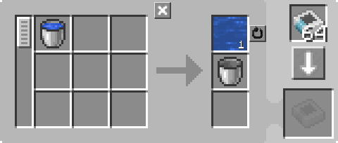
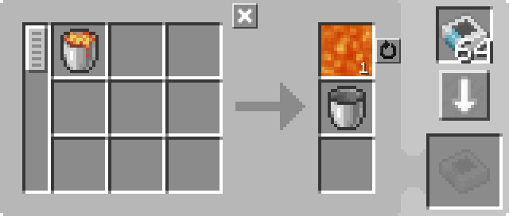

---
navigation:
  parent: example-setups/example-setups-index.md
  title: 桶倒液器
  icon: minecraft:bucket
---

# 桶倒液器

另请参阅[桶装液器](bucket-filler.md)。

请注意，由于此方案使用了<ItemLink id="pattern_provider" />，它旨在集成到你的[自动合成](../ae2-mechanics/autocrafting.md)设置中。

有时候，生活并不便利——你需要流体本身，但只能制作装有流体的桶。有些机器可以帮你完成这个任务（如热力膨胀的流体装罐机），但并非总是有方便的模组可用。幸运的是，原版Minecraft有一种稍微不那么方便的方式——<ItemLink id="minecraft:dispenser" />。

<GameScene zoom="6" interactive={true}>
  <ImportStructure src="../assets/assemblies/bucket_emptier.snbt" />

<BoxAnnotation color="#dddddd" min="2 1 0" max="3 2 1">
        (1) 样板供应器：设置为"有红石信号时锁定合成"并开启阻挡模式，带有相关的处理样板。

        <Row>
        
        
        </Row>
  </BoxAnnotation>

<BoxAnnotation color="#dddddd" min="2.1 2 0.1" max="2.9 2.2 0.9">
        (2) 接口：默认配置。
  </BoxAnnotation>

<BoxAnnotation color="#dddddd" min="3.1 2 1.1" max="3.9 2.2 1.9">
        (3) 存储总线 #1：默认配置。
  </BoxAnnotation>

<BoxAnnotation color="#dddddd" min="4.05 1.05 0.8" max="4.95 1.95 1">
        (4) 消除面板：无GUI可供配置。
  </BoxAnnotation>

<BoxAnnotation color="#dddddd" min="3.2 1.2 0.8" max="3.8 1.8 1">
        (5) 输入总线：筛选为桶。
        <ItemImage id="minecraft:bucket" scale="2" />
  </BoxAnnotation>

<BoxAnnotation color="#dddddd" min="3 1.1 0.1" max="3.2 1.9 0.9">
        (6) 存储总线 #2：默认配置。
  </BoxAnnotation>

<DiamondAnnotation pos="0 1.5 0.5" color="#00ff00">
        连接主网络
    </DiamondAnnotation>

  <IsometricCamera yaw="225" pitch="45" />
</GameScene>

## 配置

* <ItemLink id="pattern_provider" />（1）设置为"有红石信号时锁定合成"并开启阻挡模式，带有相关的<ItemLink id="processing_pattern" />。
  
    
    

* <ItemLink id="interface" />（2）为默认配置。
* 第一个<ItemLink id="storage_bus" />（3）为默认配置。
* <ItemLink id="annihilation_plane" />（4）没有GUI，无法配置。
* <ItemLink id="import_bus" />（5）筛选为桶。
  <ItemImage id="minecraft:bucket" scale="2" />
* 第二个<ItemLink id="storage_bus" />（6）为默认配置。

## 工作原理

1. <ItemLink id="pattern_provider" />将材料推入<ItemLink id="interface" />。（实际上，作为优化，它会直接通过存储总线推送，就好像它是供应器面的延伸一样。物品实际上不会进入接口。）
2. 通过[管道子网](pipe-subnet.md#providing-to-multiple-places)中描述的机制，桶最终进入<ItemLink id="minecraft:dispenser" />。
3. <ItemLink id="minecraft:comparator" />检测到发射器中的桶，从而同时为发射器供能并锁定<ItemLink id="pattern_provider" />。
4. 发射器将桶中的流体倾倒出来，此时发射器中有一个空桶。
5. <ItemLink id="import_bus" />从发射器中取出空桶，通过<ItemLink id="storage_bus" />将其存储到样板供应器中，将其送回主网络。
6. 比较器检测到发射器为空，解除对供应器的锁定。