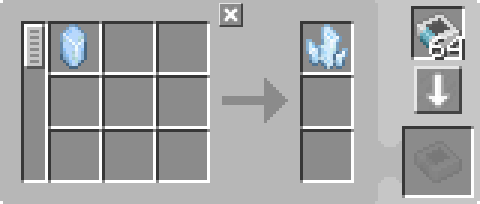

---
navigation:
  parent: example-setups/example-setups-index.md
  title: 充能器自动化
  icon: charger
---

# 充能器自动化

请注意，由于此方案使用了<ItemLink id="pattern_provider" />，它旨在集成到你的[自动合成](../ae2-mechanics/autocrafting.md)设置中。如果你只是想单独自动化<ItemLink id="charger" />，请使用漏斗、箱子等物品。

<ItemLink id="charger" />的自动化非常简单。<ItemLink id="pattern_provider" />将材料推入充能器，然后[管道子网](pipe-subnet.md)或其他物品管道将产物推回供应器。

<GameScene zoom="6" interactive={true}>
  <ImportStructure src="../assets/assemblies/charger_automation.snbt" />

<BoxAnnotation color="#dddddd" min="1 0 0" max="2 1 1">
        (1) 样板供应器：默认配置，带有相关的处理样板。同时为充能器提供能源。

        
  </BoxAnnotation>

<BoxAnnotation color="#dddddd" min="0 1 0" max="1 1.3 1">
        (2) 输入总线：默认配置。
  </BoxAnnotation>

<BoxAnnotation color="#dddddd" min="1 1 0" max="2 1.3 1">
        (3) 存储总线：默认配置。
  </BoxAnnotation>

<DiamondAnnotation pos="4 0.5 0.5" color="#00ff00">
        连接主网络
    </DiamondAnnotation>

  <IsometricCamera yaw="195" pitch="30" />
</GameScene>

## 配置

* <ItemLink id="pattern_provider" />（1）为默认配置，带有相关的<ItemLink id="processing_pattern" />。它还充当[线缆](../items-blocks-machines/cables.md)为<ItemLink id="charger" />提供[能源](../ae2-mechanics/energy.md)。
  
    

* <ItemLink id="import_bus" />（2）为默认配置。
* <ItemLink id="storage_bus" />（3）为默认配置。

## 工作原理

1. <ItemLink id="pattern_provider" />将材料推入<ItemLink id="charger" />。
2. 充能器执行充能操作。
3. 绿色子网上的<ItemLink id="import_bus" />从充能器中取出产物，并尝试将其存储到[网络存储](../ae2-mechanics/import-export-storage.md)中。
4. 绿色子网上唯一的存储是<ItemLink id="storage_bus" />，它将产物存储在样板供应器中，将其送回主网络。
