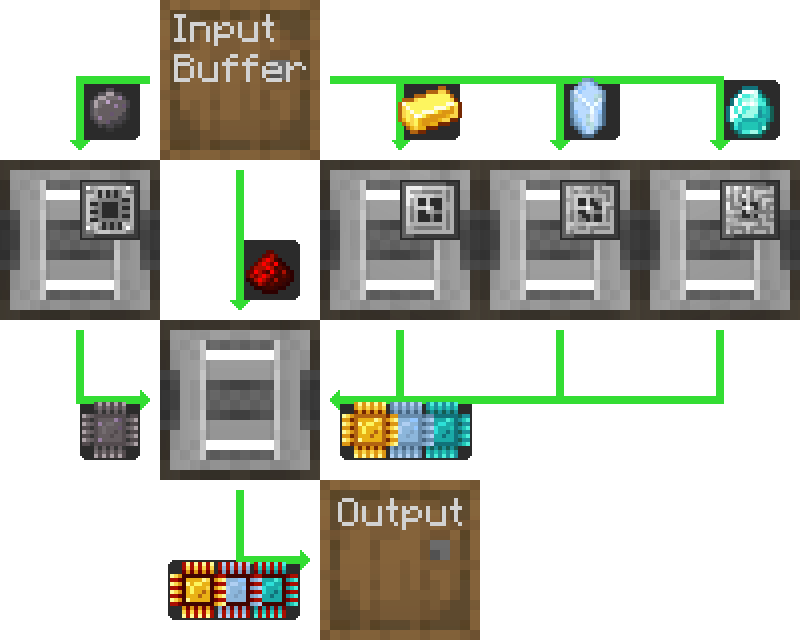
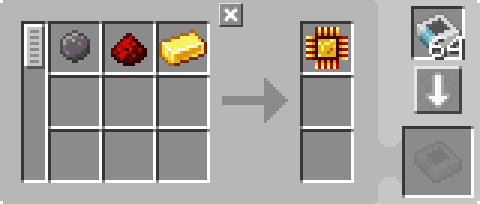
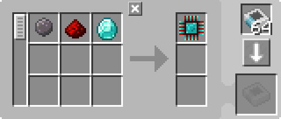

---
navigation:
  parent: example-setups/example-setups-index.md
  title: 处理器自动化
  icon: logic_processor
---

# 处理器生产的自动化

有许多方法可以自动化[处理器](../items-blocks-machines/processors.md)，这只是其中一种。

这种通用布局可以使用任何类型的物品物流管道、导管、管道或任何模组的物品传输方式，只要你能对其进行过滤即可。

以下是仅使用AE2的["管道"子网](pipe-subnet.md)来实现的详细说明。

请注意，由于此方案使用了<ItemLink id="pattern_provider" />，它旨在集成到你的[自动合成](../ae2-mechanics/autocrafting.md)设置中。如果你只是想单独自动化处理器，将样板供应器替换为另一个木桶，并将原材料直接放入上方的木桶中。

此方案恰好与旧版AE2向后兼容，因为即使<ItemLink id="inscriber" />具有面朝性，管道子网仍然可以从正确的面插入和提取物品。

## 关于样板编码的一课

通常，你需要编码的[样板](../items-blocks-machines/patterns.md)**与你在JEI中看到的并不相同**，也不同于JEI点击"+"按钮输出的内容。在这种情况下，JEI会输出2个独立的样板——一个用于压印组件，一个用于最终组装，而且压印组件的样板会包含一个[压印模板](../items-blocks-machines/presses.md)。这不是我们想要的，因为这不是该设置实际执行的操作。我们需要的是一个输入原始资源并输出完成的处理器的样板，而且由于压印模板已经在压印器中，我们不应该将其放入样板中。

---

<GameScene zoom="4" interactive={true}>
  <ImportStructure src="../assets/assemblies/processor_automation.snbt" />

  <BoxAnnotation color="#dddddd" min="5 1 0" max="6 2 1" thickness=".05">
        (1) 样板供应器：默认配置，带有相关的处理样板。

        <Row>
            
            
            
        </Row>
  </BoxAnnotation>

  <BoxAnnotation color="#dddddd" min="4.7 2 0" max="5 3 1" thickness=".05">
        (2) 存储总线 #1：默认配置。
  </BoxAnnotation>

  <BoxAnnotation color="#dddddd" min="4 1 0" max="4.3 2 1" thickness=".05">
        (3) 输出总线 #1：过滤为硅，装有2张加速卡
        <Row><ItemImage id="silicon" scale="2" /> <ItemImage id="speed_card" scale="2" /></Row>
  </BoxAnnotation>

  <BoxAnnotation color="#dddddd" min="4 4 0" max="4.3 3 1" thickness=".05">
        (4) 输出总线 #2：过滤为金锭，装有2张加速卡
        <Row><ItemImage id="minecraft:gold_ingot" scale="2" /> <ItemImage id="speed_card" scale="2" /></Row>
  </BoxAnnotation>

  <BoxAnnotation color="#dddddd" min="4 5 0" max="4.3 4 1" thickness=".05">
        (5) 输出总线 #3：过滤为赛特斯石英水晶，装有2张加速卡
        <Row><ItemImage id="certus_quartz_crystal" scale="2" /> <ItemImage id="speed_card" scale="2" /></Row>
  </BoxAnnotation>

  <BoxAnnotation color="#dddddd" min="4 6 0" max="4.3 5 1" thickness=".05">
        (6) 输出总线 #4：过滤为钻石，装有2张加速卡
        <Row><ItemImage id="minecraft:diamond" scale="2" /> <ItemImage id="speed_card" scale="2" /></Row>
  </BoxAnnotation>

  <BoxAnnotation color="#dddddd" min="2.3 3 0" max="2 2 1" thickness=".05">
        (7) 输出总线 #5：过滤为红石粉，装有2张加速卡
        <Row><ItemImage id="minecraft:redstone" scale="2" /> <ItemImage id="speed_card" scale="2" /></Row>
  </BoxAnnotation>

  <BoxAnnotation color="#dddddd" min="4 1 0" max="3 2 1" thickness=".05">
        (8) 压印器 #1：默认配置。装有硅压印模板和4张加速卡
        <Row><ItemImage id="silicon_press" scale="2" /> <ItemImage id="speed_card" scale="2" /></Row>
  </BoxAnnotation>

  <BoxAnnotation color="#dddddd" min="4 3 0" max="3 4 1" thickness=".05">
        (9) 压印器 #2：默认配置。装有逻辑处理器压印模板和4张加速卡
        <Row><ItemImage id="logic_processor_press" scale="2" /> <ItemImage id="speed_card" scale="2" /></Row>
  </BoxAnnotation>

  <BoxAnnotation color="#dddddd" min="4 4 0" max="3 5 1" thickness=".05">
        (10) 压印器 #3：默认配置。装有运算处理器压印模板和4张加速卡
        <Row><ItemImage id="calculation_processor_press" scale="2" /> <ItemImage id="speed_card" scale="2" /></Row>
  </BoxAnnotation>

  <BoxAnnotation color="#dddddd" min="4 5 0" max="3 6 1" thickness=".05">
        (11) 压印器 #4：默认配置。装有工程处理器压印模板和4张加速卡
        <Row><ItemImage id="engineering_processor_press" scale="2" /> <ItemImage id="speed_card" scale="2" /></Row>
  </BoxAnnotation>

  <BoxAnnotation color="#dddddd" min="2 2 0" max="1 3 1" thickness=".05">
        (12) 压印器 #5：默认配置。装有4张加速卡
        <ItemImage id="speed_card" scale="2" />
  </BoxAnnotation>

  <BoxAnnotation color="#dddddd" min="2.7 2 0" max="3 1 1" thickness=".05">
        (13) 输入总线 #1：默认配置，装有2张加速卡
        <ItemImage id="speed_card" scale="2" />
  </BoxAnnotation>

  <BoxAnnotation color="#dddddd" min="2.7 4 0" max="3 3 1" thickness=".05">
        (14) 输入总线 #2：默认配置，装有2张加速卡
        <ItemImage id="speed_card" scale="2" />
  </BoxAnnotation>

  <BoxAnnotation color="#dddddd" min="2.7 5 0" max="3 4 1" thickness=".05">
        (15) 输入总线 #3：默认配置，装有2张加速卡
        <ItemImage id="speed_card" scale="2" />
  </BoxAnnotation>

  <BoxAnnotation color="#dddddd" min="2.7 6 0" max="3 5 1" thickness=".05">
        (16) 输入总线 #4：默认配置，装有2张加速卡
        <ItemImage id="speed_card" scale="2" />
  </BoxAnnotation>

  <BoxAnnotation color="#dddddd" min="2 3 0" max="1 3.3 1" thickness=".05">
        (17) 存储总线 #2：默认配置。
  </BoxAnnotation>

  <BoxAnnotation color="#dddddd" min="2 1.7 0" max="1 2 1" thickness=".05">
        (18) 存储总线 #3：默认配置。
  </BoxAnnotation>

  <BoxAnnotation color="#dddddd" min="1 2 0" max="0.7 3 1" thickness=".05">
        (19) 输入总线 #5：默认配置，装有2张加速卡
        <ItemImage id="speed_card" scale="2" />
  </BoxAnnotation>

  <BoxAnnotation color="#dddddd" min="5 0.7 0" max="6 1 1" thickness=".05">
        (20) 存储总线 #4：默认配置。
  </BoxAnnotation>

<BoxAnnotation color="#dddddd" min="3.3 2.7 0.3" max="3.7 3 0.7" thickness=".05">
        石英光纤为所有3个压印器供能，因为压印器像线缆一样传输能源
  </BoxAnnotation>

<DiamondAnnotation pos="7 1.5 0.5" color="#00ff00">
        连接主网络
    </DiamondAnnotation>

  <IsometricCamera yaw="185" pitch="5" />
</GameScene>

## 配置

* <ItemLink id="pattern_provider" />（1）为默认配置，带有相关的<ItemLink id="processing_pattern" />。请注意，样板直接从原始资源到完成的处理器，**不**包含[压印模板](../items-blocks-machines/presses.md)。

  
  
  

* <ItemLink id="storage_bus" />（2、17、18、20）为默认配置。
* <ItemLink id="export_bus" />（3-7）过滤为相关原材料。装有2张<ItemLink id="speed_card" />。
    <Row>
      <ItemImage id="silicon" scale="2" />
      <ItemImage id="minecraft:gold_ingot" scale="2" />
      <ItemImage id="certus_quartz_crystal" scale="2" />
      <ItemImage id="minecraft:diamond" scale="2" />
      <ItemImage id="minecraft:redstone" scale="2" />
    </Row>
* <ItemLink id="import_bus" />（13-16、19）为默认配置。装有2张<ItemLink id="speed_card" />。
* <ItemLink id="inscriber" />为默认配置。装有相关的[压印模板](../items-blocks-machines/presses.md)和4张<ItemLink id="speed_card" />。
   <Row>
     <ItemImage id="silicon_press" scale="2" />
     <ItemImage id="logic_processor_press" scale="2" />
     <ItemImage id="calculation_processor_press" scale="2" />
     <ItemImage id="engineering_processor_press" scale="2" />
   </Row>

## 工作原理

1. <ItemLink id="pattern_provider" />将原材料推入木桶。
2. 第一个[管道子网](pipe-subnet.md)（橙色）从木桶中拉取硅、红石粉和相关处理器的原材料（金锭、赛特斯石英水晶或钻石），并将它们放入相关的<ItemLink id="inscriber" />。
3. 前四个<ItemLink id="inscriber" />分别制作<ItemLink id="printed_silicon" />，以及<ItemLink id="printed_logic_processor" />、<ItemLink id="printed_calculation_processor" />或<ItemLink id="printed_engineering_processor" />。
4. 第二和第三个[管道子网](pipe-subnet.md)（绿色）从前四个<ItemLink id="inscriber" />中取出压印好的电路，并将它们放入第五个最终组装<ItemLink id="inscriber" />。
5. 第五个<ItemLink id="inscriber" />组装[处理器](../items-blocks-machines/processors.md)。
6. 第四个[管道子网](pipe-subnet.md)（紫色）将处理器放入样板供应器，将其返回主网络。