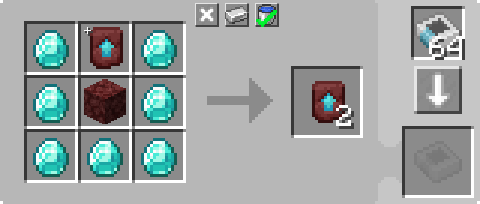

---
navigation:
  parent: example-setups/example-setups-index.md
  title: 递归合成
  icon: minecraft:netherite_upgrade_smithing_template
---

# 递归合成设置

如[自动合成](../ae2-mechanics/autocrafting.md)中所述，自动合成规划算法无法处理主要产物是输入材料之一的配方。例如，它无法处理复制<ItemLink id="minecraft:netherite_upgrade_smithing_template" />。

一种解决方案是利用<ItemLink id="level_emitter" />假装成[样板](../items-blocks-machines/patterns.md)的能力。

然后利用它来启动一个不断执行合成的小型设置。在本例中，我们将展示一个复制<ItemLink id="minecraft:netherite_upgrade_smithing_template" />的设置。

<RecipeFor id="minecraft:netherite_upgrade_smithing_template" />

***

<GameScene zoom="6" interactive={true}>
  <ImportStructure src="../assets/assemblies/recursive_recipe_setup.snbt" />

  <BoxAnnotation color="#dddddd" min="1 0 0" max="2 1 1">
        (1) 接口：设置为存储所需的额外材料：钻石和下界岩。
        <Row><ItemImage id="minecraft:diamond" scale="2" /> <ItemImage id="minecraft:netherrack" scale="2" /></Row>
  </BoxAnnotation>

  <BoxAnnotation color="#dddddd" min="2.3 1 0.3" max="2.7 1.3 0.7">
        (2) 标准发信器：配置为"下界合金锻造模板"，设置为"发射红石信号以合成物品"。
        <Row><ItemImage id="minecraft:netherite_upgrade_smithing_template" scale="2" /> <ItemImage id="crafting_card" scale="2" /></Row>
  </BoxAnnotation>

  <BoxAnnotation color="#dddddd" min="2 0 0" max="2.3 1 1">
        (3) 输入总线 #1：过滤为接口中存储的物品。装有红石卡。红石模式设置为"有信号时激活"。
        <Row>
        <ItemImage id="minecraft:diamond" scale="2" />
        <ItemImage id="minecraft:netherrack" scale="2" />
        <ItemImage id="redstone_card" scale="2" />
        </Row>
  </BoxAnnotation>

  <BoxAnnotation color="#dddddd" min="3 1 1" max="4 1.3 2">
        (4) 存储总线 #1：设置为比另一个存储总线更高的优先级。非常重要。
  </BoxAnnotation>

  <BoxAnnotation color="#dddddd" min="3 0 1" max="4 1 2">
        (5) 分子装配室：内含复制锻造模板的样板。

        

        首次建造时，需要手动放入一个锻造模板。
  </BoxAnnotation>

  <BoxAnnotation color="#dddddd" min="2.7 0 1" max="3 1 2">
        (6) 输入总线 #2：默认配置。
  </BoxAnnotation>

  <BoxAnnotation color="#dddddd" min="1 0 1" max="2 1 1.3">
        (7) 存储总线 #2：过滤为"下界合金锻造模板"。设置为比另一个存储总线更低的优先级。
        <ItemImage id="minecraft:netherite_upgrade_smithing_template" scale="2" />
  </BoxAnnotation>

<DiamondAnnotation pos="0 0.5 0.5" color="#00ff00">
        连接主网络
    </DiamondAnnotation>

  <IsometricCamera yaw="15" pitch="30" />
</GameScene>

## 配置

* <ItemLink id="interface" />（1）设置为存储所需的额外材料：钻石和下界岩。
* <ItemLink id="level_emitter" />（2）配置为"下界合金锻造模板"，设置为"发射红石信号以合成物品"。
* 第一个<ItemLink id="import_bus" />（3）过滤为接口中存储的物品。装有红石卡。红石模式设置为"有信号时激活"。
* 第一个<ItemLink id="storage_bus" />（4）设置为比第二个存储总线更*高*的[优先级](../ae2-mechanics/import-export-storage.md#storage-priority)。
* <ItemLink id="molecular_assembler" />（5）内含复制锻造模板的样板，并且已手动放入一个锻造模板。

  

* 第二个<ItemLink id="import_bus" />（6）为默认配置。
* 第二个<ItemLink id="storage_bus" />（7）过滤为"下界合金锻造模板"。设置为比第一个存储总线更*低*的[优先级](../ae2-mechanics/import-export-storage.md#storage-priority)。

## 工作原理

1. 由于插入了<ItemLink id="crafting_card" />并设置为"发射红石信号以合成物品"，<ItemLink id="level_emitter" />假装成一个[样板](../items-blocks-machines/patterns.md)。因此，"下界合金锻造模板"会在[终端](../items-blocks-machines/terminals.md)中显示为一个有效的[自动合成](../ae2-mechanics/autocrafting.md)选项。
2. 当收到来自玩家或系统自身的合成该物品的请求时，标准发信器开启。
3. 第一个<ItemLink id="import_bus" />被标准发信器激活，从<ItemLink id="interface" />中拉取出存储的材料。
4. 网络上唯一能够存储这些材料的<ItemLink id="storage_bus" />是装配室上的那个。
5. <ItemLink id="molecular_assembler" />接收材料（内部已有一个锻造模板），执行合成，产出2个锻造模板。
6. 第二个<ItemLink id="import_bus" />提取1个锻造模板。
7. 第一个存储总线优先级更高，因此该锻造模板回到装配室中。
8. 第二个<ItemLink id="import_bus" />再提取1个锻造模板。
9. 装配室无法再接收锻造模板，因此第二个锻造模板进入优先级较低的存储总线，被插入接口中。
10. <ItemLink id="interface" />未设置存储锻造模板，因此将其插入网络中。