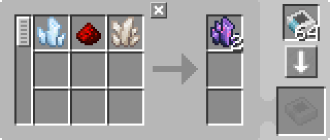
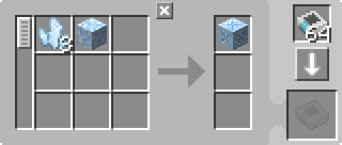
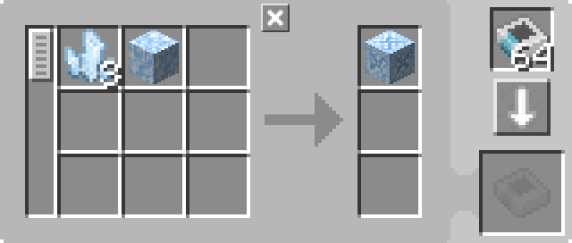

---
navigation:
  parent: example-setups/example-setups-index.md
  title: 丢入水中自动化
  icon: fluix_crystal
---

# 丢入水中配方的自动化

请注意，由于此方案使用了<ItemLink id="pattern_provider" />，它旨在集成到你的[自动合成](../ae2-mechanics/autocrafting.md)设置中。

某些配方需要将物品丢入水中（虽然类似的方案也可用于将物品丢到其他地方）。
这可以通过<ItemLink id="formation_plane" />、<ItemLink id="annihilation_plane" />以及一些辅助基础设施来实现自动化（这本质上是2个修改版的[管道子网](pipe-subnet.md)）。

此方案需要与[充能器自动化](charger-automation.md)配合使用，以提供<ItemLink id="charged_certus_quartz_crystal" />。

<GameScene zoom="6" interactive={true}>
  <ImportStructure src="../assets/assemblies/throw_in_water.snbt" />

<BoxAnnotation color="#dddddd" min="2 0 1" max="3 1 2">
        (1) 样板供应器：默认配置，带有相关的处理样板。

         
  </BoxAnnotation>

<BoxAnnotation color="#dddddd" min="1.7 0 1" max="2 1 2">
        (2) 接口：默认配置。
  </BoxAnnotation>

<BoxAnnotation color="#dddddd" min="1 .7 1" max="2 1 2">
        (3) 成型面板：设置为将输入物品以掉落物形式投放。
  </BoxAnnotation>

<BoxAnnotation color="#dddddd" min="1 2 1" max="2 2.3 2">
        (4) 破坏面板：无GUI可配置。
  </BoxAnnotation>

<BoxAnnotation color="#dddddd" min="2 1 1" max="3 1.3 2">
        (5) 存储总线：过滤为样板的输出物
        <Row><ItemImage id="fluix_crystal" scale="2" /><BlockImage id="flawless_budding_quartz" scale="2" /></Row>
  </BoxAnnotation>

<DiamondAnnotation pos="3.9 0.5 1.5" color="#00ff00">
        连接主网络和充能器自动化
        <GameScene zoom="3" background="transparent">
          <ImportStructure src="../assets/assemblies/charger_automation.snbt" />
          <IsometricCamera yaw="195" pitch="30" />
        </GameScene>
    </DiamondAnnotation>

  <IsometricCamera yaw="180" pitch="0" />
</GameScene>

## 配置与样板

* <ItemLink id="pattern_provider" />（1）为默认配置，带有相关的<ItemLink id="processing_pattern" />
  * 对于<ItemLink id="fluix_crystal" />，使用JEI/REI中的默认配方即可：

    

  * 对于<ItemLink id="flawed_budding_quartz" />，最好直接从<ItemLink id="quartz_block" />制作，
    这样可以避免一个配方的输入是另一个配方的输出，导致存储总线无法过滤的问题：

    

* <ItemLink id="interface" />（2）为默认配置。
* <ItemLink id="formation_plane" />（3）设置为将输入物品以掉落物形式投放。
* <ItemLink id="annihilation_plane" />（4）无GUI，无法配置。
* <ItemLink id="storage_bus" />（5）过滤为样板的输出物。

## 工作原理

1. <ItemLink id="pattern_provider" />将材料推入其侧面绿色子网上的<ItemLink id="interface" />
2. 接口（默认配置为不存储任何物品）尝试将其内容推入[网络存储](../ae2-mechanics/import-export-storage.md)
3. 绿色子网上唯一的存储是<ItemLink id="formation_plane" />，它将接收到的物品投入水中
4. 橙色子网上的<ItemLink id="annihilation_plane" />尝试拾取刚掉落的物品，但无法做到，因为
   样板供应器上方的<ItemLink id="storage_bus" />（橙色子网上唯一的存储）被过滤为只接受可能的合成产物
5. 物品在世界中执行转化。
6. 破坏面板现在可以拾取其前方的物品，因为存储总线允许存储它们。
7. 存储总线将产物存储在样板供应器中，将其送回网络。
