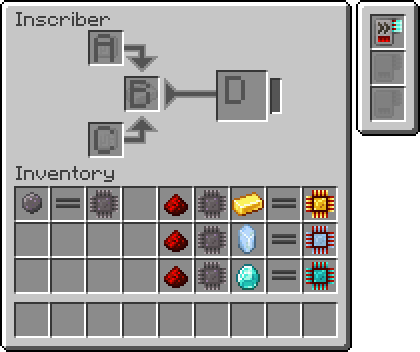
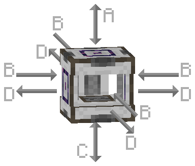

---
navigation:
  parent: items-blocks-machines/items-blocks-machines-index.md
  title: 压印器
  icon: inscriber
  position: 310
categories:
- machines
item_ids:
- ae2:inscriber
---

# 压印器

<BlockImage id="inscriber" scale="8" />

压印器用于使用[压印模板](presses.md)压印电路和[处理器](processors.md)，也可将各种物品粉碎为粉末。
它可以接受AE2的能源（AE）或Fabric/Forge能源（E/FE）。它可以设置为有方向性模式，即从不同面插入物品会放入其物品栏的不同槽位。为方便操作，可以使用<ItemLink id="certus_quartz_wrench" />旋转它。
它还可以设置为将合成结果推入相邻的容器中。

输入缓冲区的大小可以调整。例如，如果你想从一个容器向大量压印器阵列供料，
你需要较小的缓冲区，以便材料在压印器之间更均匀地分配（而不是第一个压印器填满64个，其余的为空）。

4种电路压印模板用于制作[处理器](processors.md)：

<Row>
  <ItemImage id="silicon_press" scale="4" />

  <ItemImage id="logic_processor_press" scale="4" />

  <ItemImage id="calculation_processor_press" scale="4" />

  <ItemImage id="engineering_processor_press" scale="4" />
</Row>

而名称压印模板可以像铁砧一样为方块命名，适合在<ItemLink id="pattern_access_terminal" />中为物品添加标签。

<ItemImage id="name_press" scale="4" />

## 设置

* 压印器可以设置为有方向性模式（如下所述）或允许从任何方向向任何槽位输入物品，由内部过滤器决定物品去向。在无方向性模式下，物品无法从顶部和底部槽位提取。
* 压印器可以设置为将物品推入相邻的容器中。
* 输入缓冲区的大小可以调整，大缓冲区适用于手动喂料的独立压印器，小缓冲区则使大型并行化设置更加高效。

## 界面与方向性

在有方向性模式下，压印器根据你插入或提取物品的方向来过滤物品的去向。

 

A. **顶部输入** 通过压印器的顶部面访问（物品可以推入和拉出此槽位）

B. **中间输入** 通过压印器的左、右、前、后面插入（物品只能推入此槽位，不能拉出）

C. **底部输入** 通过压印器的底部面访问（物品可以推入和拉出此槽位）

D. **输出** 通过压印器的左、右、前、后面拉出（物品只能从此槽位拉出，不能推入）

## 简单自动化

例如，方向性和可旋转性意味着你可以像这样半自动化压印器：

<GameScene zoom="4" background="transparent">
  <ImportStructure src="../assets/assemblies/inscriber_hopper_automation.snbt" />
  <IsometricCamera yaw="195" pitch="30" />
</GameScene>

或者在无方向性模式下，直接用管道连接压印器进行输入和输出。

## 升级卡

压印器支持以下[升级卡](upgrade_cards.md)：

*   <ItemLink id="speed_card" />

## 合成配方

<RecipeFor id="inscriber" />
