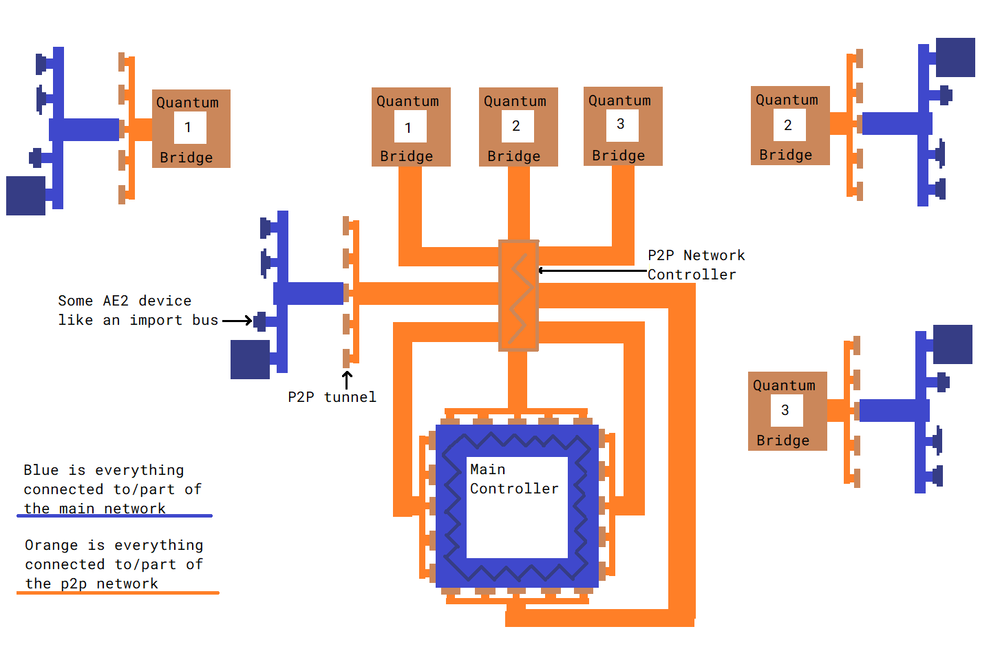

---
navigation:
  parent: items-blocks-machines/items-blocks-machines-index.md
  title: P2P通道
  icon: me_p2p_tunnel
  position: 210
categories:
- devices
item_ids:
- ae2:me_p2p_tunnel
- ae2:redstone_p2p_tunnel
- ae2:item_p2p_tunnel
- ae2:fluid_p2p_tunnel
- ae2:fe_p2p_tunnel
- ae2:light_p2p_tunnel
---

# 点对点通道

<GameScene zoom="6" background="transparent">
  <ImportStructure src="../assets/assemblies/p2p_tunnels.snbt" />
  <IsometricCamera yaw="195" pitch="30" />
</GameScene>

P2P通道是一种在不与网络直接交互的情况下，在网络中传输物品、流体、红石信号、能量、光线和[频道](../ae2-mechanics/channels.md)的方式。P2P通道有许多种类，但每种只能传输其特定类型的事物。它们本质上就像传送门一样，可以直接连接远距离的两个方块面。它们不是双向的，有明确的输入端和输出端。

例如，漏斗朝向物品P2P通道时，会表现得就像直接连接到木桶一样，物品会自动流入。

<GameScene zoom="4" background="transparent">
  <ImportStructure src="../assets/assemblies/p2p_hopper_barrel.snbt" />
  <IsometricCamera yaw="195" pitch="30" />
</GameScene>

然而，相邻的两个木桶之间不会互相传输物品。

<GameScene zoom="4" background="transparent">
  <ImportStructure src="../assets/assemblies/p2p_barrel_barrel.snbt" />
  <IsometricCamera yaw="195" pitch="30" />
</GameScene>

还有其他种类，比如红石P2P通道。

<GameScene zoom="4" background="transparent">
  <ImportStructure src="../assets/assemblies/p2p_redstone.snbt" />
  <IsometricCamera yaw="195" pitch="30" />
</GameScene>

以及ME P2P通道，用于传输频道。

<GameScene zoom="4" background="transparent">
  <ImportStructure src="../assets/assemblies/p2p_channels.snbt" />
  <IsometricCamera yaw="195" pitch="30" />
</GameScene>

## P2P通道的类型与调谐

<GameScene zoom="6" background="transparent">
  <ImportStructure src="../assets/assemblies/p2p_tunnels.snbt" />
  <IsometricCamera yaw="180" pitch="90" />
</GameScene>

P2P通道有许多类型。只有ME P2P通道可以直接合成，其他的需要右键点击已有的P2P通道并使用特定物品来转换：
- ME P2P通道：使用任意[线缆](../items-blocks-machines/cables.md)右键点击选择。
- 红石P2P通道：使用各种红石元件右键点击选择。
- 物品P2P通道：使用箱子或漏斗右键点击选择。
- 流体P2P通道：使用桶或瓶子右键点击选择。
- 能源P2P通道：使用几乎任何含有能量的物品右键点击选择。
- 光P2P通道：使用火把或萤石右键点击选择。

某些通道类型有特殊机制。例如，ME P2P通道的频道无法穿过其他ME P2P通道，而能源P2P通道会通过增加自身的[能量](../ae2-mechanics/energy.md)消耗，间接对流经的FE能量收取2.5%的"税"。

## P2P最常用的形式

P2P通道最常见的用途是使用ME P2P通道来提高[频道](../ae2-mechanics/channels.md)传输的密度。无需一捆致密线缆，只需一根致密线缆就能承载许多频道。

在这个例子中，8个ME P2P输入端从主网络的<ItemLink id="controller" />获取256个频道（8*32），然后由8个ME P2P输出端将它们输出到其他位置。注意每个P2P通道的输入端或输出端只占用1个频道。因此我们可以通过一根细线缆传输大量频道。而且由于P2P通道位于专用的[子网络](../ae2-mechanics/subnetworks.md)上，我们甚至不会消耗主网络的任何频道！还要注意，虽然P2P通道可以直接放在控制器旁边，但也可以在中间放置一根[致密智能线缆](../items-blocks-machines/cables.md#smart-cable)来更方便地可视化频道。

<GameScene zoom="4" interactive={true}>
  <ImportStructure src="../assets/assemblies/p2p_compact_channels.snbt" />

  <BoxAnnotation color="#dddddd" min="1.3 1.3 6.3" max="2 2.7 6.7">
        石英纤维在主网络和P2P子网络之间共享能量。
  </BoxAnnotation>

  <BoxAnnotation color="#dddddd" min="4.1 0 5.7" max="5 2.3 6.4">
        你可以将通道输入端直接放在控制器上，也可以通过线缆连接。
  </BoxAnnotation>

  <IsometricCamera yaw="225" pitch="30" />
</GameScene>

更多示例（包括与[量子链接仓](quantum_bridge.md)的配合使用），请参见这张我懒得修改的画图示意图：

## 嵌套

但是，你不能用这种方式通过单根线缆发送无限多的频道。ME P2P通道的频道不会穿过另一个ME P2P通道，因此你无法递归嵌套它们。注意观察红色线缆上的外层ME P2P通道处于离线状态。请注意，这只适用于ME P2P通道，其他类型的P2P通道可以穿过ME P2P通道，如图中红石P2P通道正常工作所示。

<GameScene zoom="4" background="transparent">
  <ImportStructure src="../assets/assemblies/p2p_nesting.snbt" />
  <IsometricCamera yaw="225" pitch="30" />
</GameScene>

## 链接

<GameScene zoom="6" background="transparent">
  <ImportStructure src="../assets/assemblies/p2p_linking_frequency.snbt" />
  <IsometricCamera yaw="195" pitch="30" />
</GameScene>

P2P通道连接的两端可以使用<ItemLink id="memory_card" />进行链接。频率会以2x2的颜色阵列显示在通道背面。
- Shift+右键点击：生成新的P2P链接频率。
- 右键点击：粘贴设置、升级卡或链接频率。

你Shift+右键点击的通道将成为输入端，而右键点击的通道将成为输出端。你可以有多个输出端，但对于ME P2P通道，输入端流入的频道会在各输出端之间分配，因此你无法复制频道。

## 合成配方

<RecipeFor id="me_p2p_tunnel" />